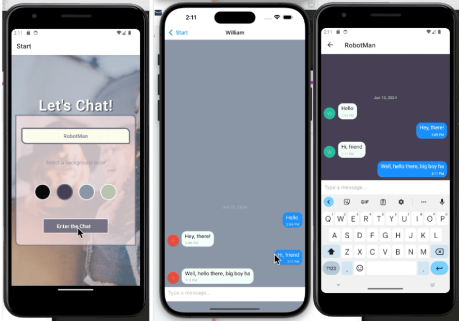

## Project description

A mobile chat application built with React Native. The app will provide users with a chat interface and options to share images and their location.

### Getting Started

To run this app locally, you'll need to follow these steps:

- Clone this repository.
- Set up Expo in your development environment:

  - Install Expo and Expo CLI, as this is the platform you’ll use to build your app;

    npm install -g expo-cli

  - Install Expo Go app on your mobile device, so that you can test your app on your own mobile device;

    Search for the Expo Go app in the relevant app store for your device (iOS or Android)

  - Create an Expo account.

### Prerequisites

Before installing Expo, ensure you have a suitable version of Node installed. At the time of writing, Expo only supports Node 16.. at max.

Node.js: Download and install Node.js. For this you can use the nvm tool https://github.com/nvm-sh/nvm

    nvm install 16.19.0
    nvm use 16.19.0
    nvm alias default 16.19.0

Navigate to the chat-app directory and run

    npm install

## Start the App

- Use the Expo Go App on your mobile device to check the UI

- Initialize the app in your terminal:

        npx expo start

  A mobile chat application built with React Native The app offers users a multi-user chat interface with additional options to share images or location. Users can access messages and files from chat history without an internet connection. The app works on iOS and Android devices. Google Firestore provide storage for images and messages. Chat access is handled by Google Firebase. The default is anonymous sign in, but Firebase offers [many different options for authentication](https://firebase.google.com/docs/auth).

## Technologies Used

- [React Native](https://reactnative.dev/)
- [Expo](https://expo.dev)
- [Google Firebase](https://firebase.google.com)
- [React Native Gifted Chat](https://github.com/FaridSafi/react-native-gifted-chat)
- [Android Studio](https://developer.android.com/studio/)

## Project Setup

#### Prerequisites

- It is recommended, though not required, to use Node version 16

* In the terminal, you can run the following commands:
* `node --version` to find your current version
* You can use [Node Version Manager](https://github.com/nvm-sh/nvm) to switch to Node 16.

#### Using the free tier of Google Firebase

- Start a new project at [Firebase](https://firebase.google.com).
- Set up the database under Build --> Firestore Database
- Set up storage under Build --> Storage
- Change rules for database and storage to: `allow read, write: if true`
- Obtain the configuration code, and add it to `firebaseConfig` in App.js:
- Activate authentication for your project to allow users to sign in as anonymous

### Installation

1. Clone the repository & globally install Expo CLI

`git clone https://github.com/animalelder/chat`
`npm install -g expo-cli`

2. Navigate to the project directory
3. install dependencies with `npm install`

4. Start the expo project with `npx expo start`
5. Install Expo Go app on your mobile device, so that you can test your app on your own mobile device
6. Open Expo Go on your mobile device and select the development server.

### Screenshots on iOS

